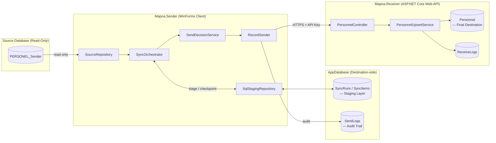
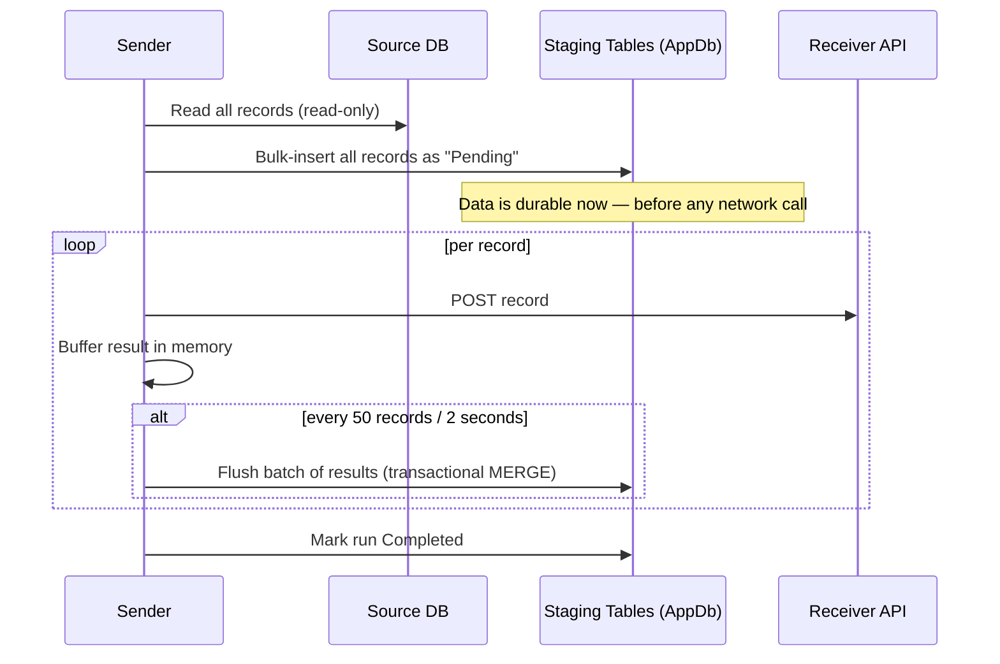
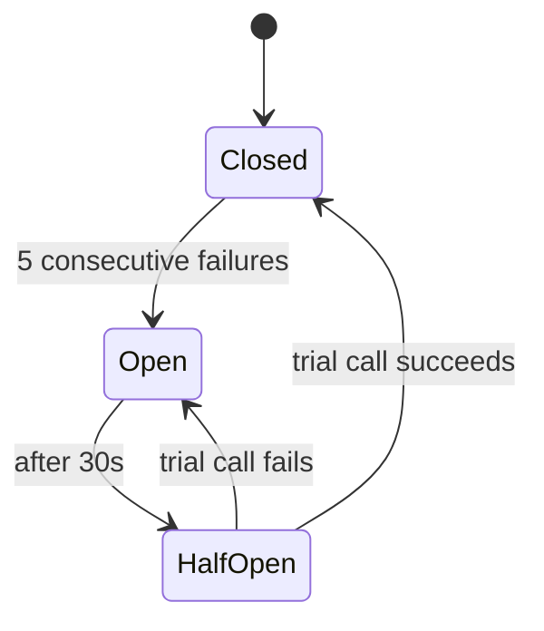
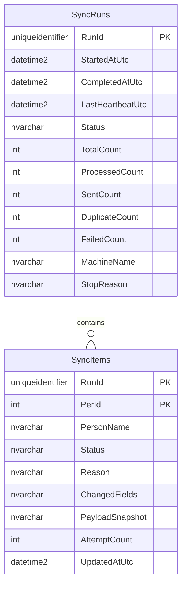

# Mapna ETL — Resilient Personnel Synchronization System

[](https://dotnet.microsoft.com/)
[](https://www.microsoft.com/sql-server)
[](https://learn.microsoft.com/ef/core/)
[](https://github.com/App-vNext/Polly)
[](https://serilog.net/)
[](#license)

A fault-tolerant ETL (Extract–Transform–Load) system that synchronizes personnel records from a source database to a remote receiving service over an unreliable network — designed to survive network outages, application crashes, and duplicate/concurrent runs **without losing data or double-processing records**.

Built for deployment across multiple client sites, where the connection between the local client and the central server is expected to drop occasionally — sometimes for seconds, sometimes for minutes.

---

## Table of Contents

- [Why This Exists](#why-this-exists)
- [Architecture Overview](#architecture-overview)
- [Project Structure](#project-structure)
- [Reliability & Fault-Tolerance Design](#reliability--fault-tolerance-design)
  - [The Staging Pattern](#the-staging-pattern)
  - [Retry & Circuit Breaker](#retry--circuit-breaker)
  - [Idempotency & Duplicate Prevention](#idempotency--duplicate-prevention)
  - [Crash Recovery & Resume](#crash-recovery--resume)
  - [Concurrency Control](#concurrency-control)
- [Database Schema](#database-schema)
- [Tech Stack](#tech-stack)
- [Getting Started](#getting-started)
- [Configuration](#configuration)
- [Observability & Logging](#observability--logging)
- [Design Decisions & Trade-offs](#design-decisions--trade-offs)
- [License](#license)

---

## Why This Exists

Classic point-to-point sync jobs ("read from A, write to B") work fine until the network drops mid-run. Without a durable checkpoint, a client application either:

- **Loses track** of what it already sent (risking duplicate downstream writes), or
- **Restarts from zero** every time (wasting time and risking inconsistent state), or
- **Crashes outright**, requiring manual intervention.

This project solves that with a **Staging Layer** — a well-established pattern from ETL system design — combined with the **Retry** and **Circuit Breaker** resilience patterns, so the system degrades gracefully under network failure and recovers automatically once connectivity returns.

---

## Architecture Overview



The Sender **never writes to the source database** — it is strictly a read source. All operational state (staging, audit logs) lives in the same **AppDatabase** as the destination system, giving a single, centrally-monitorable source of truth across every deployed client machine.

---

## Project Structure

| Project | Responsibility |
|---|---|
| **`Mapna.Contracts`** | Shared DTOs (`PersonnelRecord`) and validation rules, referenced by both Sender and Receiver. |
| **`Mapna.LogData`** | EF Core data layer: `LogDbContext`, entities (`Personnel`, `SendLogEntry`, `ReceiveLogEntry`), and migrations. |
| **`Mapna.Receiver`** | ASP.NET Core Web API. Receives personnel data, performs idempotent upsert with field-level change detection, authenticates via API key. |
| **`Mapna.Sender`** | WinForms client application. Orchestrates the read → stage → send pipeline with full resilience against network failure. |

### Key files inside `Mapna.Sender`

```
Mapna.Sender/
├── SourceRepository.cs        # Read-only access to the source database
├── SendDecisionService.cs     # Decides Send / Skip-Duplicate / Skip-Invalid per record
├── RecordSender.cs            # Performs the actual HTTP call + audit logging
├── SyncOrchestrator.cs        # Coordinates the full pipeline; owns all resilience logic
├── Staging/
│   ├── SqlStagingRepository.cs   # Durable staging store (SyncRuns / SyncItems)
│   ├── StagingModels.cs          # Staging domain models
│   └── Sql/*.sql                 # DBA-reviewable schema scripts
├── Logging/
│   └── LoggingSetup.cs         # Structured Serilog configuration + named events
└── Form1.cs                    # UI: live progress, drill-down, resume prompts
```

---

## Reliability & Fault-Tolerance Design

This is the core engineering focus of the project. Every design decision below maps directly to a specific failure scenario the system must survive.

### The Staging Pattern

Before a single record is sent over the network, **the entire batch is durably recorded as `Pending`** in a staging schema living in the destination database:



This directly solves the scenario of *"30,000 records are loaded, network drops — nothing may be lost."* Two tables drive this:

| Table | Purpose |
|---|---|
| `dbo.SyncRuns` | One row per execution — status, live counters, heartbeat. |
| `dbo.SyncItems` | One row per `(RunId, PersonId)` — tracks each record's outcome (`Pending → Sent / Duplicate / ValidationFailed / SendFailed`). |

**Why a SQL table and not a message queue or local file?** A dedicated queue (RabbitMQ, Kafka) is designed for multi-producer/multi-consumer topologies — overkill for a single client with one linear job. A local file (SQLite) would fragment visibility across every deployed site. A table in the existing, already-backed-up, already-monitored destination database gives durability and central observability at zero extra infrastructure cost.

### Retry & Circuit Breaker

Every network-facing operation — reading the source, calling the Receiver API, writing to the staging tables — is wrapped with [Polly](https://github.com/App-vNext/Polly):

- **Retry** with exponential backoff (3 attempts: 2s → 4s → 8s) absorbs brief blips.
- **Circuit Breaker** (opens after 5 consecutive failures, stays open 30s) prevents hammering a downed dependency and gives the UI a clear **"waiting for connectivity"** state instead of silently failing thousands of records.



The exact same threshold (5 failures / 30s) is applied uniformly across three independent failure surfaces — the Receiver API, the AppDatabase staging writes, and the source database read — so the application behaves predictably no matter which dependency is degraded.

### Idempotency & Duplicate Prevention

Two independent, cooperating layers guarantee that re-processing a record is always safe:

1. **Sender-side**: `SendDecisionService` compares each record against the last successfully sent snapshot; unchanged records are classified `Duplicate` and never re-transmitted.
2. **Receiver-side**: `PersonnelUpsertService` performs field-level change detection before writing, so even a redundant POST (from the narrow crash window between "sent successfully" and "checkpoint written") never creates duplicate state.

This combination gives **at-least-once delivery with idempotent processing** — a far more practical guarantee than attempting true exactly-once semantics over an unreliable network.

### Crash Recovery & Resume

On startup, the application checks the staging tables for any run left in a non-terminal state:

- `Running` with a stale heartbeat (> 2 minutes) → the process almost certainly crashed.
- `Paused` → stopped cleanly after an unexpected error.

If found, the user is offered to resume. Only records still `Pending` are reprocessed — and critically, **they are re-validated against a fresh read of the source database**, not the stale snapshot captured before the interruption, so any changes made to source data during the outage are correctly picked up.

### Concurrency Control

Before starting, the orchestrator checks for another run with a **fresh heartbeat** (updated every flush cycle). If one is found, the new run is refused — preventing two concurrent executions from corrupting shared counters or double-sending records. A crashed run's heartbeat naturally goes stale after 2 minutes, so this self-heals without manual cleanup.

---

## Database Schema



Schema provisioning is **fully automatic** — `SqlStagingRepository.EnsureSchemaAsync` creates the tables, the table-valued type, and the stored procedure on first run if they don't already exist. The equivalent, DBA-reviewable raw SQL lives in [`Mapna.Sender/Staging/Sql/`](./Mapna.Sender/Staging/Sql/).

---

## Tech Stack

| Layer | Technology |
|---|---|
| Runtime | .NET 10 |
| Client UI | Windows Forms |
| API | ASP.NET Core Web API |
| ORM | Entity Framework Core (SQL Server provider, automatic retry-on-failure) |
| High-throughput data access | Dapper + `SqlBulkCopy` / Table-Valued Parameters |
| Resilience | Polly (Retry, Circuit Breaker) |
| Structured logging | Serilog (rolling file sink, structured `EventType` properties) |
| Database | Microsoft SQL Server |

---

## Getting Started

### Prerequisites

- .NET 10 SDK
- SQL Server (LocalDB is sufficient for local development)
- Visual Studio 2022+ (or any IDE with .NET 10 / WinForms support)

### Setup

1. **Clone the repository**
   ```bash
   git clone <your-repo-url>
   cd ETL
   ```

2. **Configure connection strings** in `Mapna.Sender/appsettings.json` and `Mapna.Receiver/appsettings.json` — see [Configuration](#configuration) below.

3. **Apply EF Core migrations** for the core schema (`Personnel`, `SendLogs`, `ReceiveLogs`):
   ```bash
   dotnet ef database update --project Mapna.LogData
   ```
   The staging schema (`SyncRuns`, `SyncItems`) requires **no manual step** — it is created automatically the first time `Mapna.Sender` runs.

4. **Run the Receiver API**
   ```bash
   dotnet run --project Mapna.Receiver
   ```

5. **Run the Sender** (from Visual Studio, or):
   ```bash
   dotnet run --project Mapna.Sender
   ```

---

## Configuration

### `Mapna.Sender/appsettings.json`

```json
{
  "SourceDatabase": {
    "ConnectionString": "Server=...;Database=...;..."
  },
  "AppDatabase": {
    "ConnectionString": "Server=...;Database=...;..."
  },
  "ReceiverApi": {
    "BaseUrl": "https://your-receiver-host/",
    "ApiKey": "your-api-key"
  },
  "Logging": {
    "Directory": "logs"
  }
}
```

| Key | Purpose |
|---|---|
| `SourceDatabase` | **Read-only.** The origin of personnel data. Never written to. |
| `AppDatabase` | Destination-side database — hosts the staging tables and the audit log. |
| `ReceiverApi` | Base URL and API key for the destination service. |
| `Logging:Directory` | Folder for daily rolling Serilog log files. |

> ⚠️ In production, `SourceDatabase` and `AppDatabase` **must** point to two genuinely separate databases. They may coincide in local development purely for convenience.

---

## Observability & Logging

Every log line carries a structured `EventType` for easy filtering:

| Event | Meaning |
|---|---|
| `RunStarted` / `RunResumed` / `RunCompleted` / `RunInterrupted` | Run lifecycle |
| `StageCompleted` | Bulk staging insert finished |
| `ConnectivityLost` / `ConnectivityRestored` | A circuit breaker opened / closed |
| `CircuitOpened` / `CircuitClosed` | Low-level circuit state transitions |
| `ConcurrentRunBlocked` | A second run was refused due to an active execution |
| `SourceReadFailed` | The source database could not be read after retrying |

Because `dbo.SyncRuns` is centralized, an operator can inspect the state of **every deployed client machine** with a single query — no need to remote into individual sites to check logs.

```sql
SELECT RunId, MachineName, Status, StartedAtUtc, SentCount, FailedCount
FROM dbo.SyncRuns
ORDER BY StartedAtUtc DESC;
```

---

## Design Decisions & Trade-offs

A few deliberate choices, documented for future maintainers:

- **Batched checkpointing (every 50 records / 2 seconds)** instead of per-record or end-of-run only: bounds the "at risk on crash" window to a small, known size without paying the cost of a network round-trip per record.
- **SendLogs is flushed before the staging batch**, not after: if the SendLogs write fails, the staging items are simply left `Pending` and get correctly re-classified as `Duplicate` on the next resume. The reverse order would risk marking records "final" in staging while the audit trail silently missed them.
- **Separate circuit breakers per dependency** (Receiver API, AppDatabase via Dapper, AppDatabase via EF Core) rather than one shared instance — different client libraries throw different exception shapes, so each gets its own predicate, but all three share identical thresholds for one consistent mental model.
- **Heartbeat-based concurrency guard** rather than a true distributed lock (`sp_getapplock`): sufficient for a single-instance-per-site deployment model, and self-healing without requiring explicit cleanup after a crash.

---

## License

*Internal / proprietary project for Mapna. Adjust this section if the repository will be made public or shared under a specific license (MIT, Apache-2.0, etc.).*
